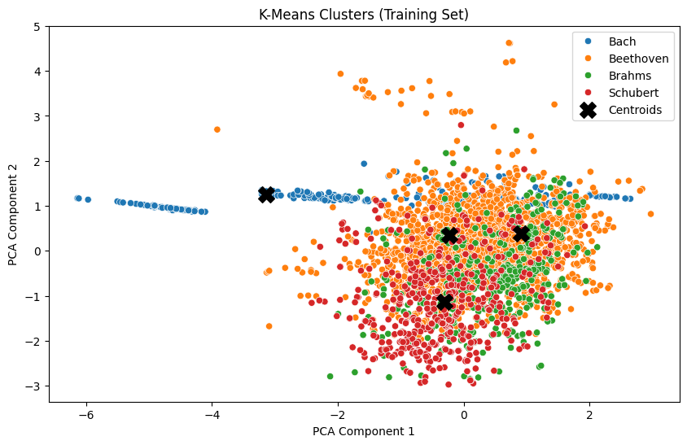

# ClassicalComposer

This is a programming challenge for SFL. A client has requested the development of a composer classifier based on live-captured audio that can stream chunks of data to the model at 15, 30, or 60-second intervals, as desired. The input to the model will be MIDI files. The specific task is to create a binary classifier that identifies whether a streamed MIDI file was composed by any of the following composers: **Bach, Beethoven, Schubert, Brahms** or **not**.

The **initial assessment** is available below in the **Project Analysis** section

### Client Spec
The original client spec is available in `docs/client_spec.txt`.

## Development Setup
You will need the **Challenge_DataSet.zip** file in order to run the pipline. Open settings.toml and set the `source_data_file` location and the `data_folder` path to an accessible location for this container. Additionally if you plan to train the CNN on an NVIDIA GPU you will need to set up the .env file
Copy the `.env.example` file to `.env` and update the placeholder values with your actual configuration:
```bash
cp .env.example .env
```

### Building
This container may take some time to build. It is assumed you are using **VS Code** and **Dev Containers**. You can also build it manually with the following command:
```bash
docker compose --project-name classicalcomposer -f <PATH_TO_CODE>\docker-compose.yml -f <PATH_TO_CODE>\.devcontainer\docker-compose.yml -f <PATH_TO_TO_LOG> build
```

### Python Environment and Dependency Management 
This project uses **Hatch** to manage the Python environment and dependencies. For more information, see the [hatch basic usage](https://hatch.pypa.io/latest/tutorials/environment/basic-usage/).

Run the following command to execute the main program:

```bash
hatch run python main.py```
```

In order to set the python interpreter path in VSCode use the following:
```bash
hatch env create
hatch env find
```

For manually running development tools
|tool |command|
|-----|-------|
|Unit testing| `hatch run pytest`|
|Code formatting| `hatch run black .`|
|Linting| `hatch run flake8`|
|imports sorting|`hatch run isort .`|
|type checking|`hatch run mypy src`|
|docstring checking|`hatch run pydocstyle src`|


These should all be done on the pre-commit hooks, to install these
```bash
hatch run pre-commit install
```


### Configuration Management
This project uses **dyanconf** for configuration management.Please see this link for a  [quick start](https://www.dynaconf.com/)

### Scripts
Please run the scripts in the following order.

| Script Name                               | Description                               |
|-------------------------------------------|-------------------------------------------|
| `hatch run python scripts/generate_dataset.py`    | Generates the dataset files |
| `hatch run python scripts/train_kmeans.py`    | trains the kmeans model |
| TODO: `hatch run python scripts/train_CNN.py`    | trains the kmeans model |
| TODO: `hatch run python scripts/eval.py`    | evaluate a midi file |


### Notebooks
To launch Jupyter Lab, run 
```bash
hatch run jupyter:lab
```
| Notebook Name                               | Description                               |
|-------------------------------------------|-------------------------------------------|
| `/notebooks/eda.ipynb`    | Original EDA/modeling for the project and initial research |
| `/notebooks/kmeans.ipynb`    | kmeans modeling for the project |
| `/notebooks/cnn.ipynb`    | CNN modeling for the project |


### Usage

This project ships with trained models. You can either use these pre-trained models or train new ones using the provided code (see the Scripts section for details on retraining).

### Running the Pipeline
To use the pipeline, run the following Docker commands:

`<Insert relevant Docker commands>`

### Web Front-End
To use the web front-end, run:

`<Insert relevant Docker commands>`


# Project Analysis Composer Classification

### Dataset Overview
- There are **194 files** in the **training set**.
- There are **35 files** in the **test set**.

MIDI files are unique as they do not directly store audio recordings. Instead, they represent the *score* of the music. A piece can consist of multiple instruments, each with distinct timings. MIDI files are organized into layers, each representing an instrument with timing, pitch, and velocity information. These files are intended to be played back via a MIDI synthesizer, which interprets the score and renders the sound using specified instruments.

Each MIDI file can be represented as a **Piano Roll**, which flattens all instruments into a unified score, as if the entire orchestration is played on a single piano. While this representation trades off fidelity, it is well-suited for ML applications. A Piano Roll is visualized as a 128px x N image, where N is the length of the piece sampled at a frequency \( f_s \). Below are example Piano Rolls:

| **Bach** | **Holst** |
|----------|-----------|
|||

These two pieces have clearly distinct fingerprints. The challenge lies in determining if such distinctions are sufficient for building a robust classifier.

---

### Challenges & Assumptions
The task involves 1-vs-All classification from 30-second MIDI clips. Assumptions and challenges include:

1. **MIDI Capture Assumption**:
   - Musicians use MIDI instruments, or there exists a process to capture audio and convert it into MIDI files.

2. **Data Limitation**:
   - There is limited data and no counterexamples for the "unknown" class. External datasets could augment the negative class, but:
     - These would likely come from different distributions (e.g., modern classical or pop music).
     - Misalignment between distributions could mislead model evaluation.

3. **Class Imbalance**:
   - There is a significant class imbalance for Beethoven in the training data. It is unclear if this reflects the inference-time distribution.

4. **Undefined System Requirements**:
   - The client's desired pipeline and operational use case are unclear. Further clarification is essential.

5. **Feature Engineering**:
   - Classical ML approaches demand manual feature extraction, requiring significant domain expertise. A CNN/LSTM approach may be more suitable.

6. **Interpretation Complexity**:
   - Unlike audio search models (e.g., *Shazam*), which rely on [sonic fingerprint](https://www.ee.columbia.edu/~dpwe/papers/Wang03-shazam.pdf) , this task requires identifying composers based on interpreted, partial, and low-fidelity MIDI data. This adds complexity to feature engineering.

---

### Exploratory Data Analysis (EDA) and Initial Modeling
Initial modeling used **K-means clustering** and **Gaussian Mixture Models (GMM)** with and without kernel tricks. Key steps:

- **Dataset Splits**:
  - The training set was split into training and validation sets, stratified by composition and grouped by file to prevent overlap.
  - Each composition was divided into 20 randomly sampled 30-second slices, ensuring inclusion of the first and last 30 seconds.

| **Frame Extraction Visualization** | **Class Distribution** |
|-----------------------------------|-----------------------|
|||

- **Feature Selection**:
  - Features such as **pitch entropy**, **dominant pitch**, **average velocity**, and **spectral bandwidth** were extracted and visually analyzed with Kernel Density Estimation per composer.
  - Analytical feature selection will be essential for future iterations.

- **Clustering Results**:
  - K-means clustering was used due to scalability. Cluster centroids were labeled using the mode of known data.

| **Train Clusters** | **Validation Clusters** | **Test Clusters** |
|--------------------|-------------------------|------------------|
||||

#### Evaluation Metrics
```
Silhouette Score for 4 clusters: 0.2250

------------------------------------------------------------
Validation Results:
predicted_composer  Bach  Beethoven  Brahms  Schubert
composer                                             
Bach                  44         22       0         0
Beethoven              5        589       0         0
Brahms                 0         88       0         0
Schubert               0        110       0         0

Validation Classification Report:
              precision    recall  f1-score   support

        Bach       0.90      0.67      0.77        66
   Beethoven       0.73      0.99      0.84       594
      Brahms       0.00      0.00      0.00        88
    Schubert       0.00      0.00      0.00       110

    accuracy                           0.74       858
   macro avg       0.41      0.41      0.40       858
weighted avg       0.57      0.74      0.64       858
```

The results highlight limitations in classical ML approaches. Further work is needed on feature engineering and dataset augmentation.

---

### CNN Modeling
A CNN was explored as an alternative due to its maturity and suitability for this problem. The architecture:

```plaintext
Input: (128, 3000, 1)
│
├── Conv2D(32 filters, 3x3 kernel, ReLU) + L2 Regularization
├── MaxPooling2D(2x2)
├── Dropout(0.25)
│
├── Conv2D(64 filters, 3x3 kernel, ReLU) + L2 Regularization
├── MaxPooling2D(2x2)
├── Dropout(0.25)
│
├── Flatten
├── Dense(64 units, ReLU) + L2 Regularization
├── Dropout(0.5)
│
└── Dense(4 units, Softmax) -> Output Probabilities
```

#### Training Details:
- **Batch Size**: 8, with balanced data generators.
- **Optimizer**: Adam (\( lr=0.001 \)).
- **Loss Function**: Categorical cross-entropy.
- **Metrics**: Accuracy, precision, recall.
- **Regularization**:
  - L2 Regularization (convolutional and dense layers).
  - Dropout (to improve generalization).

#### Results
| Metric               | Value    |
|----------------------|----------|
| Training Accuracy    | 0.9770   |
| Training Loss        | 0.4427   |
| Training Precision   | 0.9788   |
| Training Recall      | 0.9749   |
| Validation Accuracy  | 0.7176   |
| Validation Loss      | 1.9245   |
| Validation Precision | 0.7246   |
| Validation Recall    | 0.6965   |

| **Training History** | **AUROC Curve** |
|----------------------|-----------------|
|||

These results are promising, suggesting that CNNs are the most viable path forward.

---

### Recommendations

1. **Clarify Project Goals**:
   - Engage the client to better understand their desired outcomes and success metrics.

2. **Avoid Unrealistic Commitments**:
   - The current project scope and data constraints are unlikely to yield satisfactory results. Pursuing this project without clear goals risks client dissatisfaction and harm to SFL's reputation.

3. **Iterate on Feature Engineering and Model Choice**:
   - If the client insists on classical ML, substantial investment in feature engineering and domain expertise will be required. Alternatively, proceed with CNNs as the primary approach.

---

### References
| Project/Reference                         | License      | Source | Usage Description                                    |
|-------------------------------------------|--------------|--------|-----------------------------------------------------|
| Pretty Midi                                | MIT          | [Link](https://github.com/craffel/pretty-midi)      | MIDI file manipulation and data extraction.        |
| TensorFlow                                 | Apache 2.0   | [Link](https://github.com/tensorflow/tensorflow/)   | Deep learning modeling.                            |
| scikit-learn                               | BSD 3-Clause | [Link](https://github.com/scikit-learn/scikit-learn)| Classical ML modeling and clustering.              |
| Classifying Musical Scores by Composer     | Stanford     | [Link](https://cs229.stanford.edu/projects_fall_2018/reports/12441334.pdf)| Research inspiration for Piano Roll representation.|
